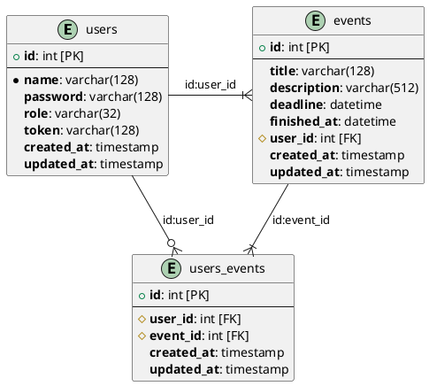

```plantuml
@startuml

entity "users" as users {
    + **id**: int [PK]
    --
    * **name**: varchar(128)
    **password**: varchar(128)
    **role**: varchar(32)
    **token**: varchar(128)
    **created_at**: timestamp
    **updated_at**: timestamp
}

entity "events" as events {
    + **id**: int [PK]
    --
    **title**: varchar(128)
    **description**: varchar(512)
    **deadline**: datetime
    **finished_at**: datetime
    # **user_id**: int [FK]
    **created_at**: timestamp
    **updated_at**: timestamp
}

entity "users_events" as users_events {
    + **id**: int [PK]
    --
    # **user_id**: int [FK]
    # **event_id**: int [FK]
    **created_at**: timestamp
    **updated_at**: timestamp
}

users -|{ events: id:user_id
users -ri-o{ users_events: id:user_id
events -do-|{ users_events: id:event_id

@enduml
```